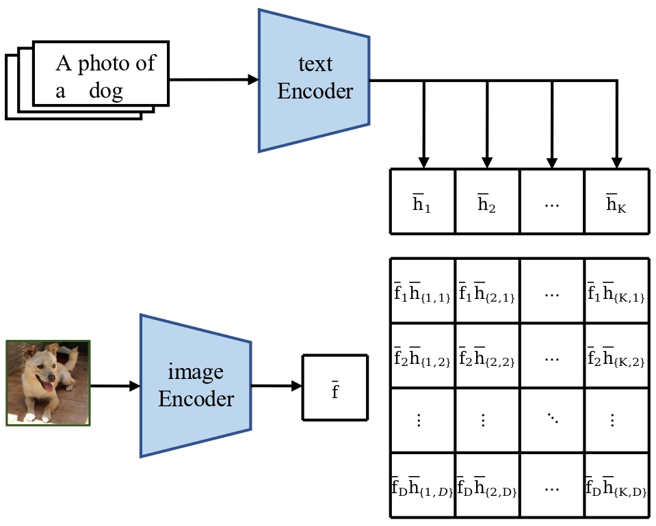

# One Last Attention for your Vision-Language Model

<div align="left" style="margin:24px 0;">
  
</div>

<p align="center">
  <a href="https://arxiv.org/abs/2506.05336"></a>
</p>

<p align="center">
  <a href="https://liangchen527.github.io/"><b>Liang Chen</b></a><sup>*</sup>, 
  <a href="https://github.com/khufia"><b>Ghazi Shazan Ahmad</b></a><sup>*</sup>, 
  <a href="https://scholar.google.com/citations?user=JlUDjukAAAAJ&hl=en"><b>Tianjun Yao</b></a><sup></sup>, 
  <a href="https://lingqiao-adelaide.github.io/lingqiaoliu.github.io//"><b>Lingqiao Liu</b></a><sup></sup>, 
  <a href="https://zhiqiangshen.com/o//"><b>Zhiqiang Shen</b></a><sup></sup>, 

</p>


<p align="center">
  <b>MBZUAI</b> · <b>The University of Adelaide</b>
</p>

<p align="center"><sup>*</sup>Equal Technical Contributions</p>

---

## 🆕 Latest Updates
- 📢 **July 2025**: Code for EFT is released!
- 📢 **June 2025**: Our paper has been accepted to ICCV 2025!


## 📊 Overview

<p align="center">
  
</p>

Pretrained vision-language models (VLMs), such as CLIP, achieve remarkable zero-shot performance, yet their downstream potential hinges on effective fine-tuning. Most adaptation methods typically focus on refining representation from separate modalities (text or vision) but neglect the critical role of their fused representations in the decision-making process, \emph{\ie} rational matrix that drives the final prediction \cite{chen2023domain}. 
%
To bridge the gap, we propose a simple yet effective \textbf{R}ational \textbf{Ada}ptaion ({RAda}) to explicitly exploit the final fused representation during fine-tuning. RAda employs a learned mask, obtained from a lightweight attention layer attached at the end of a VLM, to dynamically calibrate the contribution of each element in the rational matrix, enabling targeted adjustments to the final cross-modal interactions without incurring costly modifications to intermediate features.
%
Experiments in different settings (\emph{\ie} updating, or freezing pretrained encoders in adaptation, and test-time training that can only access the unlabeled test data) show that RAda serves as a versatile fine-tuning technique, improving the baseline with minimal code and performing comparably against current arts in most settings.

---
## 🏆 Highlights
Key contributions of **RAda**:
1. Rational Adaptation for VLMs: RAda extends the classical rational matrix to vision‑language models, directly modeling and fine‑tuning the fused image–text interactions that drive the final prediction.

2. Minimal, Encoder‑Agnostic Design: RAda plugs in a single multi‑query attention layer atop frozen encoders to learn a lightweight mask over the rational matrix—no encoder changes, just a few lines of code.

3. Broad, Consistent Gains: We validate RAda across full fine‑tuning, efficient adapter‑only tuning, and test‑time training, showing reliable improvements and competitive performance in all settings.
---
## 🧠 Architecture

<p align="center">
  
</p>
Rational Matrix in the CLIP decision-making process for a given image, where predictions (i.e. logits) are computed by summing each column. It fuses text and visual features and pro-vides a fine-grained characterization of different predictions.

---

## 📈 Results


> |1| Evaluations in the FFT setting.
<p align="center">
  
</p>


> |2| Comparison with EFT methods in the base-to-new setting.
<p align="center">
  
</p>

> |3| Comparisons with representative TTT methods regarding DG performance in four distribution shifts
<p align="center">
  
</p>


---

## 🔧 Running RAda 

### Environment setup

(1) Setup environment and PyTorch
```bash
  conda create -y -n rada python=3.12
  conda activate rada
  pip install torch==2.2.1+cu121 torchvision==0.17.1+cu121 torchaudio==2.2.1 --index-url https://download.pytorch.org/whl/cu121

```
* Clone MaPLe code repository and install requirements
```bash
# Clone RAda code base
git clone https://github.com/khufia/RAda.git

cd RAda/
```
* Install dassl library.
```bash
# Instructions borrowed from https://github.com/KaiyangZhou/Dassl.pytorch#installation

# Clone this repo
git clone https://github.com/KaiyangZhou/Dassl.pytorch.git
cd Dassl.pytorch/

# Install dependencies
pip install -r requirements.txt

# Install this library (no need to re-build if the source code is modified)
python setup.py develop
cd ..
```
* Install requirement
```bash
cd RAda
pip install -r requirements.txt
pip installl --upgrade setuptools
```
* Run EFT for Base2Novel
```bash
bash run.sh $bs $lr $ep $alpha $temp
```


## Citation 📜

```bibtex
  @misc{chen2025rada,
      title={One Last Attention for you Vision-Language Model},
      author={},
      year={2025},
      eprint={2506.05336},
      archivePrefix={arXiv},
      primaryClass={cs.CV},
url={https://arxiv.org/abs/2506.05336},
}
```

---

[](https://mbzuai.ac.ae)
